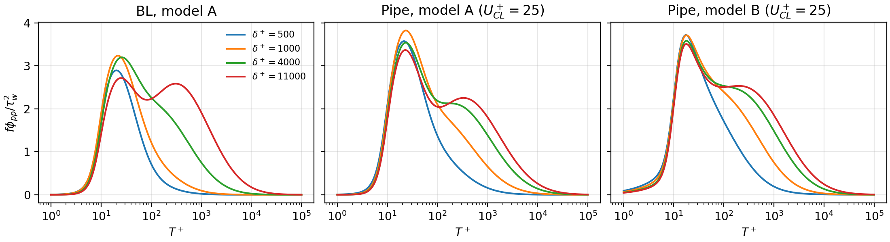

# wallpressure

Python implementation of the two-component inner–outer scaling models for the **wall-pressure
frequency spectrum** of canonical turbulent wall flows (boundary layers, pipes, channels) at friction
Reynolds numbers from 180 to 47 000:

> Massey, J.M.O., Smits, A.J. & McKeon, B.J. (2026) *Two-component inner–outer scaling model for the
> wall-pressure spectrum at high Reynolds number.* J. Fluid Mech. 1034, A60.
> [doi:10.1017/jfm.2026.11550](https://doi.org/10.1017/jfm.2026.11550)

The spectrum is the sum of an inner-scaled (Re_tau-invariant) and an outer-scaled component. It captures
the emergence of the low-frequency outer peak at high Reynolds number and the logarithmic growth of the
variance, both of which the Goody model misses.



Two versions are provided:

* **Model A** – two log-normals in the pre-multiplied spectrum. Compact; BL, pipe and channel.
* **Model B** – modified Lorentzians with prescribed asymptotic slopes and smooth Re_tau-dependence;
  calibrated on pipe data, better behaved when extrapolating.

See [docs/MODEL.md](docs/MODEL.md) for equations and constants.

## Install

```bash
git clone https://github.com/J-Massey/wall-pressure-spectrum
cd wall-pressure-spectrum
pip install -e .            # numpy only
pip install -e ".[plot,test]"   # optional: matplotlib, pytest
```

## Usage

### Dimensional inputs

```python
import numpy as np
import wallpressure as wp

f = np.logspace(1, 4.3, 200)                     # Hz
spec = wp.predict_spectrum(
    f, model="B", flow="boundary_layer",          # model "A"/"B"; flow "boundary_layer"/"pipe"/"channel"
    u_tau=1.2, nu=1.5e-5, delta=0.1,              # friction velocity, viscosity, BL thickness / radius / half-height
    u_outer=30.0, rho=1.2,                        # free-stream (BL) or centreline (pipe/channel) velocity, density
)
spec.phi_pp          # one-sided spectrum [Pa^2/Hz]
spec.premultiplied   # f*phi_pp/tau_w^2
spec.re_tau
```

`examples/quickstart.py` runs this; `examples/plot_spectra.py` regenerates the figure above.

### Non-dimensional inputs

```python
T_plus = np.logspace(0, 5, 500)                   # T+ = u_tau^2/(f nu)
wp.model_a(T_plus, re_tau=8000, flow="pipe", utau_over_uouter=1/25)   # f*phi/tau_w^2
wp.model_a_components(...)                        # (g1, g2, r_v) individually
wp.model_b(f_plus, re_tau=8000, utau_over_uouter=1/25)                # f+ = f nu/u_tau^2
wp.model_b_components(f_plus, f_outer, re_tau)                        # (g_inner, g_outer)
wp.variance_plus(f_plus, premultiplied)           # <p^2>/tau_w^2
```

### What you need to supply

| Input | Notes |
|---|---|
| `u_tau`, `nu`, `delta` | give `Re_tau = u_tau delta/nu`. `delta` = 99 % BL thickness, pipe radius, or channel half-height |
| `u_outer` | free-stream (BL) or centreline velocity. Sets the outer time scale. Optional only for a BL with model A (uses a Cf correlation); for extrapolation use a friction-law estimate of `U_e+` |
| `rho` | only to dimensionalise: `tau_w = rho u_tau^2` |

The output is the one-sided, 1-D frequency spectrum. It is not the wavenumber–frequency spectrum; combine it
with a Corcos-type model if you need that.

### Validity

Calibrated for zero-pressure-gradient BLs (δ⁺ 500–11 064), pipes (4794–47 015) and channels (180–5186).
Not for pressure gradients, roughness or compressibility. A warning is issued outside the calibrated Re_tau range.

## Data

Data are not included. Sources (Fritsch et al. BL, Lee & Moser channel, Dacome et al. pipe, Eitel-Amor et al. LES) are listed in
[docs/DATA.md](docs/DATA.md).

## Tests

```bash
pytest
```

Model A is regression-tested against a transcription of the original paper code.

## Reproducing the paper

The original fitting and plotting scripts are archived in [paper_scripts/](paper_scripts/README.md).

## Citation

Please cite the paper (see [CITATION.cff](CITATION.cff)). MIT licensed.
